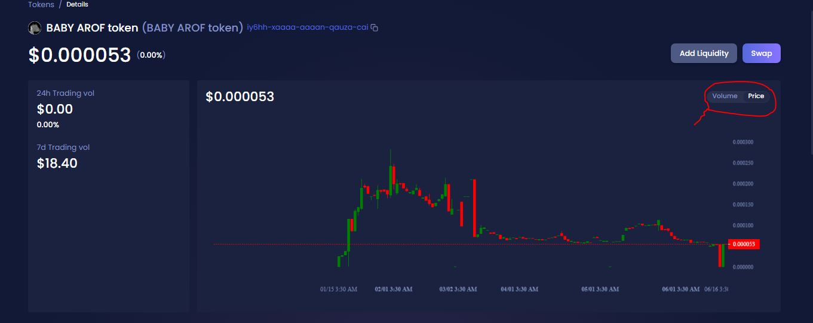
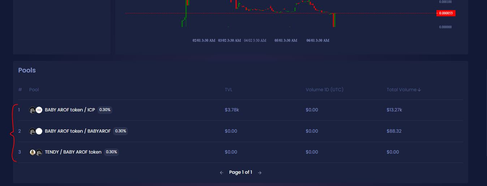
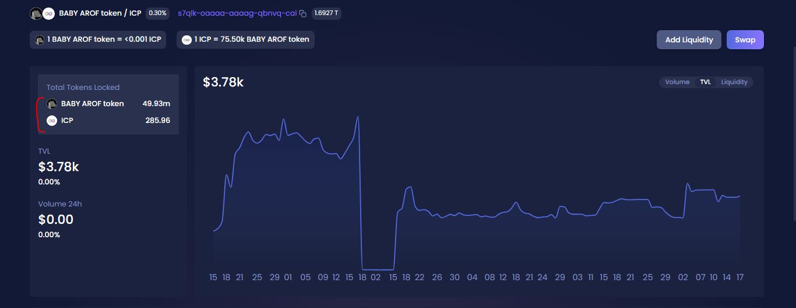

# Check price and TVL

To check the most accurate price, you can visit the ICPswap website. Direct link to BABY AROF token price chart...



<figure><figcaption>
6/18/2023
</figcaption></figure>

On this page, if we go down a bit, we can see the liquidity pools. If we click on any of the currency pairs, we can examine more details of the TVL volume.

<figure><figcaption>
6/18/2023
</figcaption></figure>

You can proceed through the following link and check the amount of locked assets, this link is specific to the BABYAROF/ICP currency pair.



<figure><figcaption>
6/18/2023
</figcaption></figure>

The image above shows exactly how much ICP is locked in the ICP blockchain along with BABY AROF. You can check this item with other pairs and it is also suggested to check these items first before investing in any project.
