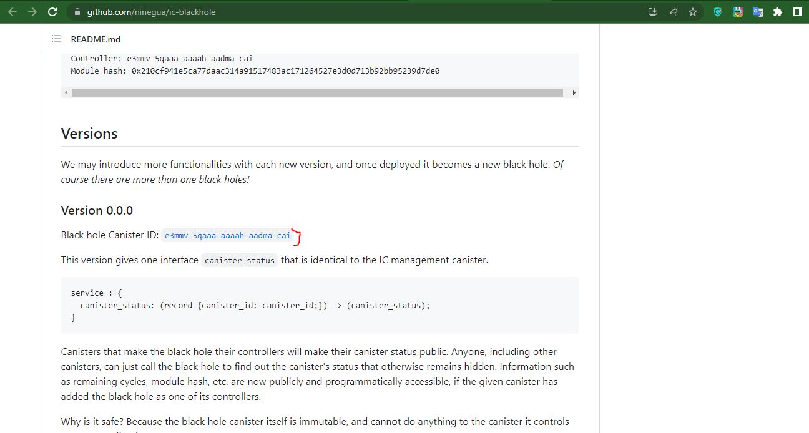
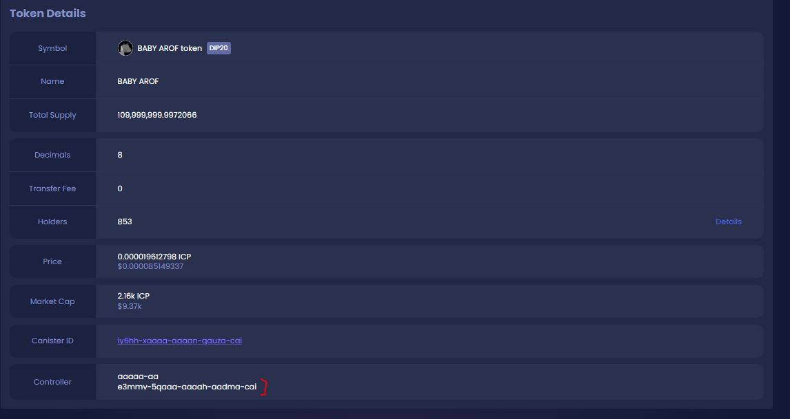

# Complete decentralization

The token controller is a tool that the developer can change the function of the token with changes in the code structure of the token, for example, the transaction fee or transfer fee between wallets can be changed. And also with the help of the controller, the token can be destroyed.

### Drop the controller into the black hole

Users who invest in altcoins should always pay attention to two things... Has the document token burned the liquidity pool? And is the controller dropped into the black hole?

If both of these questions are completed with a positive answer, you can look at and invest in that altcoins . The **dfinity** Foundation considers Canister as a black hole that is both decentralized and has the ability to record and report data.

<figure><figcaption></figcaption></figure>


Review of ICP documents


**In the open source document of the dfinity Foundation, this canister is identified and BABY AROF is the first memecoin of the canister controller chain to drop its token into the black hole.**

<figure><figcaption></figcaption></figure>


BABY AROF token controller review



[dao-structure](../../dao-structure/)

