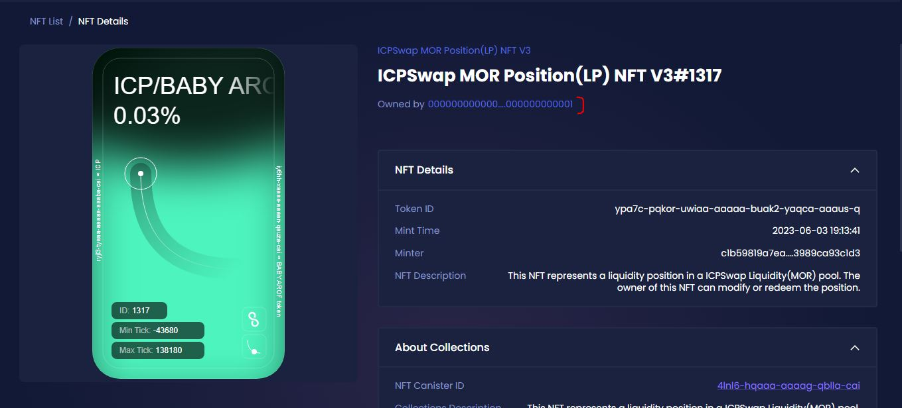

# Decentralized documentation

**When a liquidity pool is created on the ICPswap platform, it appears as an NFT ownership document in our wallet.**\
**We can transfer this ownership document which is in NFT format to another wallet.**

<mark style="color:red;">Any wallet that has these documents can drain the liquidity of the entire pool.</mark>

### Burning the province of Naqdingi

The BABY AROF project has burned the documents created during the construction of liquidity pools and transferred them to the black hole wallet to decentralize liquidity. In this case, the liquidity pool cannot be drained and there is no risk to the capital.

<figure><figcaption></figcaption></figure>

**The community can review the relevant documents through the following links.**


BABYAROF/ICP



BABYAROF/ICP


The following documents are related to the liquidity of the two standard BABY AROF tokens, the transactions of these two currency pairs have been removed. Therefore, you can consider the BABY AROF tokens of these pools burned!


EXT/DIP20



EXT/DIP20



EXT/DIP20

