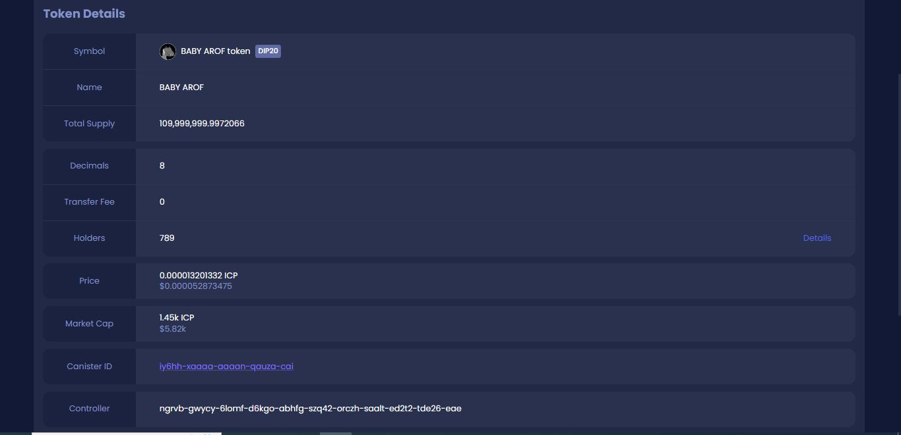
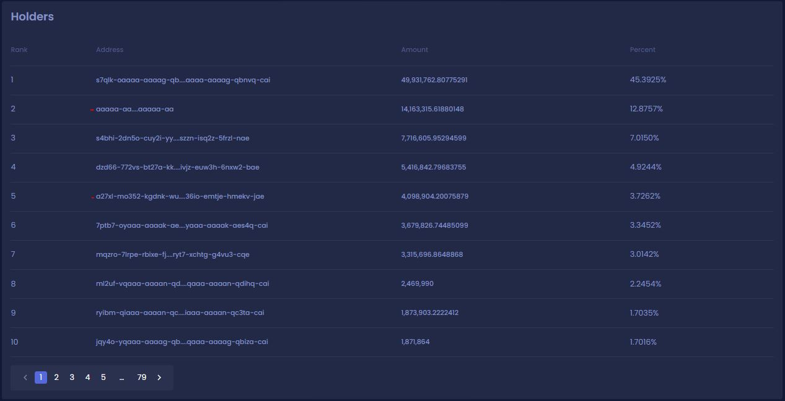
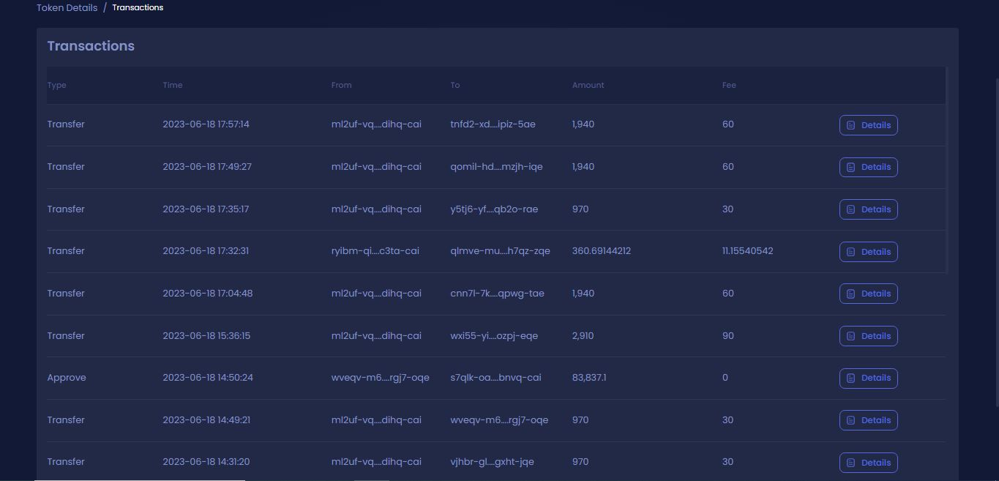

# Review of holders and market cap

In order to accurately check the market cap volume, we need to proceed through the ICPswap trading platform. You can enter the relevant page with the help of the desired link



<figure><figcaption>
6/18/2023
</figcaption></figure>

To check the holders and wallets that keep BABY AROF in detail, you can use the button below



We marked two wallets, the first is the wallet for burning tokens and the second is the wallet where fees are accumulated.

<figure><figcaption>
6/18/2023
</figcaption></figure>

With the help of the link below, you can check all transactions related to the transfer or purchase and sale of BABY AROF token in full detail.



<figure><figcaption></figcaption></figure>

