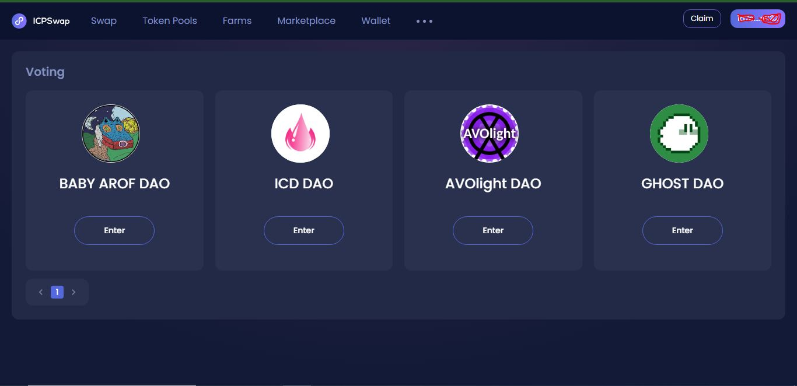

# DAO structure

### Voting to implement new events

The **DAO** is a community-driven structure for managing cryptocurrency projects. The community can vote and be influential in voting events with the help of the shares kept in their wallets.

#### BABY AROF project governance tool

BABY AROF project governance tool

As mentioned, the BABY AROF project is funded by the community. Likewise, the holders of our NFTs are the main rulers. Anyone who wants to participate in voting events ... must hold the project's NFTs.

### Implementation of standard voting

<figure><figcaption>
BABY AROF DAO
</figcaption></figure>

Thanks to the development team of the ICPswap platform, the BABY AROF project, as one of the 4 projects of the ICP blockchain chain, has a place in this forum to conduct voting with the highest standard and transparency.

All votes remain in the chain forever. You will be notified before each vote, in the next step, a screenshot of all NFT collections will be taken from the holders and we will upload this screenshot as a list of contributors to the ICPswap platform.

You can take action through the link below and check the suggestions and polls uploaded. In this way, you can get detailed information about the past and future of the project.



### How to have the right to create a proposal and voting event

There are three NFT collections that give users the right to vote! The community can be held in proportion to each NFT and of course the special voting power of the NFT has the right to vote in the DAO.

#### But who can have the right to participate and vote?

BABY AROF is committed to publishing and reporting on all social networks for each voting event. Holders who keep more than 3% of BABY AROF token liquidity in their wallets are allowed to create polls.

If you own more than 3% of BABY AROF tokens, you will be given access to create a survey and BABY AROF will publish this survey on all its social networks.

**Our suggestion is... Be sure to watch the relevant trainings before starting voting and then take action. In this case, the society can be ready to participate a little sooner**

<mark style="color:red;">**If you have more than 3% of token liquidity and are not yet allowed to participate in DAO, be sure to follow up through the developer's Twitter.**</mark>


